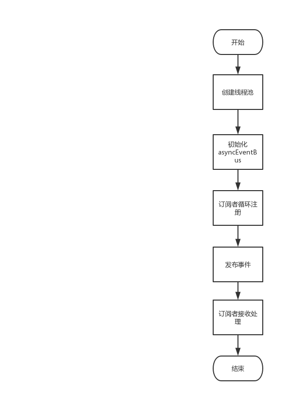

# Eventbus
## 流程图

## 创建线程池，初始化eventbus
```java
@Slf4j
@Configuration
public class EventBusConfig {
    @Bean
    public AsyncEventBus asyncEventBus() {
        log.info("{} start create thread pool executor", this.getClass().getSimpleName());
        ThreadPoolExecutor executor = new ThreadPoolExecutor(10, 20, 10, TimeUnit.SECONDS, new LinkedBlockingQueue<>(1), new NamedThreadFactory("LYW-PUBLISHER"));
        log.info("{} end create thread pool executor, executor = {}", executor.toString());
        log.info("{} start init async event bus", this.getClass().getSimpleName());
        AsyncEventBus asyncEventBus = new AsyncEventBus("LYW-PUBLISHER", executor);
        log.info("{} end init async event bus, asyncEventBus = {}", this.getClass().getSimpleName(), asyncEventBus);
        return asyncEventBus;
    }
}
```
## 订阅者循环注册
### 1. 抽象类
```java
@Slf4j
@Component
public abstract class AbstractSubscriber {
    @Autowired
    private EventBusSubscriber subscriber;

    @PostConstruct
    private void init() {
        log.info("{} init", this.getClass().getSimpleName());
        log.info("{} start register, {}", this.getClass().getSimpleName(), this.toString());
        subscriber.register(this);
        log.info("{} end register, {}", this.getClass().getSimpleName(), this.toString());
    }
}
```  

### 2. 调用eventbus注册
```java
@Slf4j
@Component
public class EventBusSubscriber {
    @Autowired
    private AsyncEventBus asyncEventBus;
    public void register(Object object) {
        log.info("{} start register object, object = {}, asyncEventBus = {}", this.getClass().getSimpleName(), object.toString(), asyncEventBus.toString());
        asyncEventBus.register(object);
    }
}
```
#### EventBus.java
##### javadoc
>**Registers all subscriber methods on {@code object} to receive events.**  
>**@param object object whose subscriber methods should be registered.**  
##### code
```java
  public void register(Object object) {
    subscribers.register(object);
  }
```
#### SubscriberRegistry.java
##### javadoc
>**Registers all subscriber methods on the given listener object.**
##### code
```java
  void register(Object listener) {
    Multimap<Class<?>, Subscriber> listenerMethods = findAllSubscribers(listener);

    for (Map.Entry<Class<?>, Collection<Subscriber>> entry : listenerMethods.asMap().entrySet()) {
      Class<?> eventType = entry.getKey();
      Collection<Subscriber> eventMethodsInListener = entry.getValue();

      CopyOnWriteArraySet<Subscriber> eventSubscribers = subscribers.get(eventType);

      if (eventSubscribers == null) {
        CopyOnWriteArraySet<Subscriber> newSet = new CopyOnWriteArraySet<Subscriber>();
        eventSubscribers =
            MoreObjects.firstNonNull(subscribers.putIfAbsent(eventType, newSet), newSet);
      }

      eventSubscribers.addAll(eventMethodsInListener);
    }
  }
```
## 发布事件
```java
@Slf4j
@Component
public class EventBusPublisher {
    @Autowired
    private AsyncEventBus asyncEventBus;

    public void post(Object event) {
        log.info("start post event = {}", event.toString());
        asyncEventBus.post(event);
        log.info("end post event = {}", event.toString());
    }
}
```
#### EventBus.java
##### javadoc
>**Posts an event to all registered subscribers. This method will return successfully after the
event has been posted to all subscribers, and regardless of any exceptions thrown by
subscribers.**  
>**If no subscribers have been subscribed for {@code event}'s class, and {@code event} is not
already a {@link DeadEvent}, it will be wrapped in a DeadEvent and reposted.**  
>**@param event event to post.**

##### code
```java
public void post(Object event) {
    Iterator<Subscriber> eventSubscribers = subscribers.getSubscribers(event);
    if (eventSubscribers.hasNext()) {
      dispatcher.dispatch(event, eventSubscribers);
    } else if (!(event instanceof DeadEvent)) {
      // the event had no subscribers and was not itself a DeadEvent
      post(new DeadEvent(this, event));
    }
  }
```
#### Dispatcher.java
##### javadoc
>**Implementation of a {@link #legacyAsync()} dispatcher.**  
##### code
```java
private static final class LegacyAsyncDispatcher extends Dispatcher {

    // This dispatcher matches the original dispatch behavior of AsyncEventBus.
    //
    // We can't really make any guarantees about the overall dispatch order for this dispatcher in
    // a multithreaded environment for a couple reasons:
    //
    // 1. Subscribers to events posted on different threads can be interleaved with each other
    //    freely. (A event on one thread, B event on another could yield any of
    //    [a1, a2, a3, b1, b2], [a1, b2, a2, a3, b2], [a1, b2, b3, a2, a3], etc.)
    // 2. It's possible for subscribers to actually be dispatched to in a different order than they
    //    were added to the queue. It's easily possible for one thread to take the head of the
    //    queue, immediately followed by another thread taking the next element in the queue. That
    //    second thread can then dispatch to the subscriber it took before the first thread does.
    //
    // All this makes me really wonder if there's any value in queueing here at all. A dispatcher
    // that simply loops through the subscribers and dispatches the event to each would actually
    // probably provide a stronger order guarantee, though that order would obviously be different
    // in some cases.

    /**
     * Global event queue.
     */
    private final ConcurrentLinkedQueue<EventWithSubscriber> queue =
        Queues.newConcurrentLinkedQueue();

    @Override
    void dispatch(Object event, Iterator<Subscriber> subscribers) {
      checkNotNull(event);
      while (subscribers.hasNext()) {
        queue.add(new EventWithSubscriber(event, subscribers.next()));
      }

      EventWithSubscriber e;
      while ((e = queue.poll()) != null) {
        e.subscriber.dispatchEvent(e.event);
      }
    }

    private static final class EventWithSubscriber {
      private final Object event;
      private final Subscriber subscriber;

      private EventWithSubscriber(Object event, Subscriber subscriber) {
        this.event = event;
        this.subscriber = subscriber;
      }
    }
  }
```